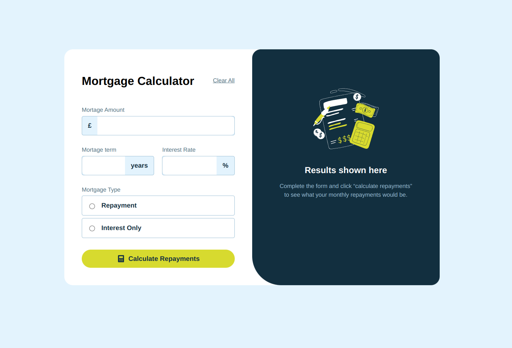

# Frontend Mentor - Mortgage repayment calculator solution

This is a solution to the [Mortgage repayment calculator challenge on Frontend Mentor](https://www.frontendmentor.io/challenges/mortgage-repayment-calculator-Galx1LXK73). Frontend Mentor challenges help you improve your coding skills by building realistic projects. 

## Table of contents

- [Overview](#overview)
  - [The challenge](#the-challenge)
  - [Screenshot](#screenshot)
  - [Links](#links)
- [My process](#my-process)
  - [Built with](#built-with)
  - [What I learned](#what-i-learned)
  - [Continued development](#continued-development)
  - [Useful resources](#useful-resources)
- [Author](#author)

**Note: Delete this note and update the table of contents based on what sections you keep.**

## Overview

### The challenge

Users should be able to:

- Input mortgage information and see monthly repayment and total repayment amounts after submitting the form
- See form validation messages if any field is incomplete
- Complete the form only using their keyboard
- View the optimal layout for the interface depending on their device's screen size
- See hover and focus states for all interactive elements on the page

### Screenshot

### Links

- Solution URL: [Github Repository](https://github.com/Gnandal/mortgage-repayment-calculator-main)
- Live Site URL: [Demo](https://gnandal.github.io/mortgage-repayment-calculator-main/)

## My process

### Built with

- Semantic HTML5 markup
- CSS custom properties
- Flexbox
- CSS Grid
- Mobile-first workflow
- JavaScript

### What I learned

Writing some clean code in my script folder.

### Continued development

In my next project, I want continue to improve myself in clean code and animation.

### Useful resources

- [CSS DOC](https://developer.mozilla.org/en-US/docs/Web/CSS/) - This helped me to know how to used greatly :where in CSS. I really liked this pattern and will use it going forward.
- [bryntum](https://bryntum.com/blog/3-ways-to-style-radio-buttons-with-modern-css/) - This is an amazing article which helped me finally understand how to customize my input radio and checkbox. I'd recommend it to anyone still learning this concept.

## Author

- Website - [GNANDAL ELISEE](https://gnandal-elisee.vercel.app)
- Frontend Mentor - [@Gnandal](https://www.frontendmentor.io/profile/Gnandal)
- X - [@gnandal_elisee](https://www.x.com/gnandal_elisee)

